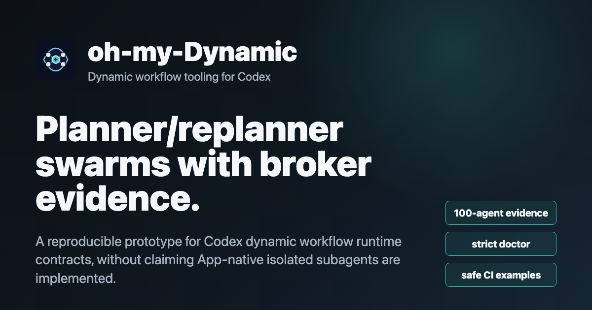

<div align="center">
  
  <h1>oh-my-Dynamic</h1>
  <p><strong>Dynamic workflow tooling for Codex.</strong></p>
  <p><a href="https://github.com/PIGU-PPPgu/oh-my-Dynamic/actions/workflows/tests.yml"></a> <a href="https://github.com/PIGU-PPPgu/oh-my-Dynamic/actions/workflows/tests.yml"></a> <a href="LICENSE"></a></p>
  <p><a href="README.zh-CN.md">中文说明</a></p>
  <a href="assets/oh-my-dynamic-showcase.mp4"></a>
  <p><a href="assets/oh-my-dynamic-showcase.mp4">Watch the 75-second showcase video</a> · <a href="docs/VIDEO_SHOWCASE.md">Render source</a></p>
</div>

**Boundary:** verified large-scale execution is Codex CLI process swarm. Codex App-native isolated subagents still depend on Codex App exposing that runtime. Defaults are read-only.

## Quick Start

CLI-only safe path:

```bash
git clone https://github.com/PIGU-PPPgu/oh-my-Dynamic.git
cd oh-my-Dynamic
python -m venv .venv
source .venv/bin/activate
python -m pip install -U pip
python -m pip install -e ".[dev]"
python -m doctor --json
python examples/real_repo_review.py --dry-run --run-id five-minute-demo --output-dir /tmp/ohmy-evidence
```

Real Codex CLI workers:

```bash
python -m doctor --json --strict-real-codex
python examples/real_repo_review.py --agents 5 --max-parallel 3 --dashboard
```

Codex App plugin install:

```bash
bash install_plugin.sh
```

Plugin install mutates local `~/.agents` symlinks and marketplace JSON. Runtime workers remain read-only by default.

Codex App skill trigger:

```text
[$oh-my-dynamic:multi-agent-run] 用 dynamic workflow 处理这个任务；App runtime 可用时使用内部 Codex subagents，否则走 in-chat fallback；大规模走 Codex CLI swarm。
```

## Run

```bash
# Safe: no key, no real workers, writes outside repo
python examples/real_repo_review.py --dry-run --run-id five-minute-demo --output-dir /tmp/ohmy-evidence

# Real: launches Codex CLI workers
python examples/real_repo_review.py --agents 5 --max-parallel 3 --dashboard

# Real adaptive workflow
python -m dynamic_workflow "review this repo" --max-rounds 2 --max-agents 20 --max-parallel 5 --stream-events

# More expensive fixed swarm
python scripts/record_swarm_evidence.py --agents 20 --max-parallel 5
```

## Controlled Rubric Lift

Bilingual report: [docs/evidence/improvement_v311.md](docs/evidence/improvement_v311.md)

This is controlled same-fixture rubric scoring, not live model quality proof. Pair it with real Codex CLI evidence before making runtime claims.

| Comparison | Quality Score | Evidence Completeness | Missing Requirements |
|------------|---------------|-----------------------|----------------------|
| fixed vs single | `+0.286` / `+46.6%` | `+0.229` | `-74.3%` |
| adaptive vs single | `+0.386` / `+62.9%` | `+0.329` | `-100%` |

## Evidence

| Evidence | Purpose |
|----------|---------|
| [benchmark_v320_real_smoke.md](docs/evidence/benchmark_v320_real_smoke.md) | v3.2 real stability smoke: single `0.537`, fixed `0.838`, adaptive `1.0` |
| [benchmark_v310.md](docs/evidence/benchmark_v310.md) | bounded real Codex CLI benchmark with failures preserved |
| [benchmark_v310_replanner_sample.md](docs/evidence/benchmark_v310_replanner_sample.md) | real planner + replanner follow-up sample |
| [swarm_100_agents_codex_cli_run_98b78a645c.md](docs/evidence/swarm_100_agents_codex_cli_run_98b78a645c.md) | fixed 100-agent Codex CLI swarm |

## Status

Stable: Codex CLI swarm, adaptive workflow, broker reducer, evidence reports. Experimental: App-native bridge, A2A gateway, TEA. Full gates are in [docs/RELEASE_CHECKLIST.md](docs/RELEASE_CHECKLIST.md).

## More

- Quickstart: [docs/QUICKSTART.md](docs/QUICKSTART.md)
- Troubleshooting/uninstall: [docs/TROUBLESHOOTING.md](docs/TROUBLESHOOTING.md)
- Official brief / demo / video / outreach: [brief](docs/OFFICIAL_BRIEF.md), [demo](docs/DEMO_SCRIPT.md), [video](docs/VIDEO_SHOWCASE.md), [outreach](docs/OUTREACH.md)
- Docs index: [docs/README.md](docs/README.md)
- Known limits: [docs/KNOWN_LIMITS.md](docs/KNOWN_LIMITS.md)
- Evidence rules: [docs/evidence/README.md](docs/evidence/README.md)
- Threat model: [docs/THREAT_MODEL.md](docs/THREAT_MODEL.md)
- v3 imports: [docs/V3_MIGRATION_GUIDE.md](docs/V3_MIGRATION_GUIDE.md)

MIT. See [LICENSE](LICENSE).
